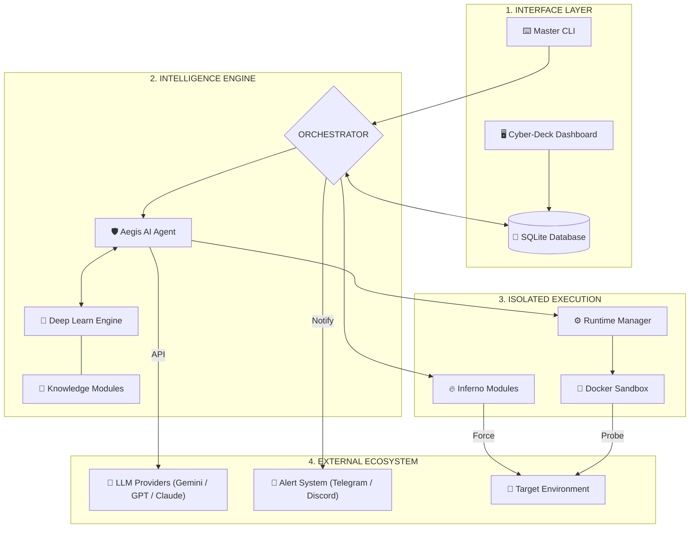
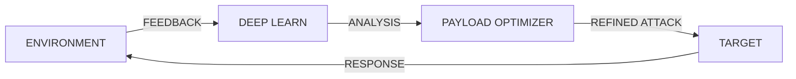

## *The Ultimate AI-Powered Security Framework for the Modern Era* 
<p align="center">

</p>

<p align="center">
  
  
  
  
</p>


---

<p align="center">
  <b>The HADES vPro-1.0 Masterwork Edition</b> represents the pinnacle of modern security engineering. Developed by <b>Anonre</b>, it seamlessly weaves together <b>Autonomous Intelligence</b>, <b>Adaptive Machine Learning</b>, and <b>High-Performance Shell Orchestration</b> into a singular, devastatingly effective security ecosystem.
</p>

---

## 🏛️ SYSTEM ARCHITECTURE & DATA FLOW

Hades is engineered with a **Modular Layered Architecture**, ensuring complete isolation between the reasoning engine and the target environment.



### 🗺️ LAYER OVERVIEW & DATA FLOW

The HADES framework operates through a **High-Sync Data Cycle**, ensuring that reasoning and execution are seamlessly linked:

1. **Interface Layer**: Captures user intent via the **Master CLI** or **Cyber-Deck Dashboard** and maintains state in the **SQLite Database**.
2. **Intelligence Engine**: The **Orchestrator** initializes the **Aegis AI Agent**, which leverages the **Deep Learn Engine** and **Knowledge Modules** to formulate a tactical attack plan.
3. **Isolated Execution**: The **Runtime Manager** spawns a secured **Docker Sandbox** where the actual security tools and **Inferno Shell Modules** are executed against the target.
4. **External Ecosystem**: Findings are enriched by **LLM Providers**, sent to the operator via the **Alert System** (Telegram/Discord), and finally committed to the target environment.

**🔄 Data Flow Journey**: `User Input` ➔ `Reasoning (AI/DL)` ➔ `Sandboxed Execution` ➔ `Target Probe` ➔ `Result Analysis` ➔ `Real-time Alert/Dashboard`.

### 🧬 THE MASTERWORK TECHNOLOGY STACK

| INTEL & REASONING | INTERFACE & CORE | EXECUTION SUITE |
| :--- | :--- | :--- |
| • Gemini 2.5 Pro / Flash | • Python 3.12 Core | • Docker Engine (Isolated) |
| • Claude 3.5 Sonnet | • FastAPI / Uvicorn API | • Kali Linux Toolset |
| • GPT-4o / Llama 3.3 | • Vite + React Dashboard | • Playwright (Automation) |
| • LiteLLM Orchestration | • SQLite Persistence | • Shell Injection Engine |

---

## 💎 THE CORE PILLARS

### 🤖 AEGIS AI: AUTONOMOUS INTELLIGENCE

The **Aegis AI Agent** is a multi-agent tree system that operates with absolute autonomy. It doesn't just scan; it **hunts**.

- **Self-Driving Hacking**: Full lifecycle execution from Recon to Reporting.
- **Micro-Specialization**: Agents spawn dynamically to handle specific vulnerability vectors.
- **Elite Logic**: Tuned to prioritize high-impact findings (RCE, SQLi, SSRF, IDOR).

### 🧬 DEEP LEARN: ADAPTIVE EVOLUTION

The **Deep Learn Engine** provides the systemic intelligence required to bypass modern defensive perimeters.



- **Learning Loops**: Every blocked request informs the next tactical move.
- **Strategic Payloads**: Dynamically generated bypasses for WAF/IPS protection.

---

## 🎮 MASTERS COMMAND MATRIX

| CATEGORY | COMMAND FLAGS | MISSION OBJECTIVE |
| :--- | :--- | :--- |
| **🤖 AI AGENT** | `-t, --target`<br>`--templates`<br>`-n, --non-interactive` | Launch the fully autonomous Aegis AI engine against high-value targets. |
| **🔍 RECON** | `-d, --mass-recon`<br>`-s, --single-recon`<br>`-f, --port-scan` | Deep infrastructure mapping and external attack surface discovery. |
| **💉 INJECTION** | `-o, --single-sql`<br>`-p, --mass-sql`<br>`-x, --single-xss`<br>`-j, --single-lfi` | Precision exploitation modules for SQLi, XSS, and Path Traversal. |
| **🛡️ SPECIAL OPS** | `-m, --mass-assess`<br>`-y, --sub-takeover`<br>`-l, --js-finder` | Advanced vulnerability assessment and sensitive secret harvesting. |
| **⚙️ SYSTEM** | `--setup-api`<br>`--setup-notifications`<br>`-i, --install` | Interactive wizards for system configuration and dependency management. |

---

## 🖥️ THE CYBER-DECK DASHBOARD

Hades features a state-of-the-art **Web Interface** that provides a mission-control view.

- **Live Stream**: Watch the AI's internal reasoning and tool outputs in real-time.
- **Attack Visualizer**: Dynamic relationship mapping of your targets and findings.
- **Reporting**: Professional Markdown/PDF export for one-click documentation.

> [!TIP]
> Launch with: `hades --web` | Access: `http://localhost:9656`

---

## 🛠️ QUICK START GUIDE

### 1. Installation

```bash
# DPKG Installation
dpkg -i hades-v1.0.deb
```

### 2. Configuration

```bash
# Setup AI Keys (Gemini, Claude, GPT, etc.)
hades --setup-api

# Setup Notifications (Telegram/Discord)
hades --setup-notifications
```

### 3. Launch First Mission

```bash
# Tactical AI Audit
hades --target https://example.com --instruction "Focus on authentication"
```

---

## 🛡️ SECURITY & ISOLATION

- **Docker Sandbox**: All AI tool operations run in isolated `hades-sandbox` containers.
- **Secure Persistence**: Encrypted session logs stored in local SQLite.
- **Authored By**: **Anonre — The Shadow of Hades.**

---
## 👁️ Preview


---
## 📜 LEGAL DISCLAIMER

> [!CAUTION]
> **LEGAL NOTICE:** This tool is for authorized security testing only. Misuse of this software is strictly prohibited. The developer assumes no liability for unauthorized actions.

<p align="center">
  <b>HADES vPRO v1.0 — THE ULTIMATE DEFENSE IS A SUPERIOR OFFENSE</b><br>
  <i>Forged in the shadows for those who guard the light.</i>
</p>
