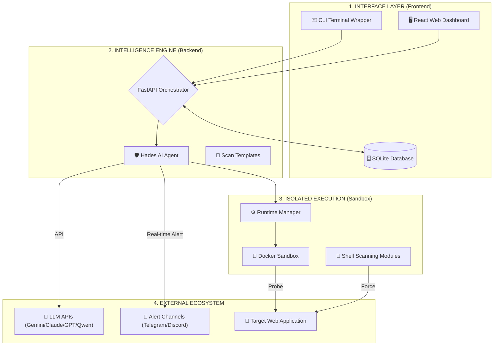

# Hades Security: Advanced AI-Powered Security Framework

Hades Security is an autonomous, AI-native web penetration testing and security assessment framework. It combines a sophisticated multi-agent reasoning engine with standard security testing shell utilities to perform dynamic vulnerability scans, execute validation Proof-of-Concepts (PoCs) in secure sandboxes, and compile detailed reports.

---

## 🏛️ SYSTEM ARCHITECTURE & DATA FLOW

Hades operates through a secure, isolated, and decoupled architecture to protect host environments and serve results in real-time.



### 🔄 Layer Overview & Data Flow
1. **Interface Layer:** Users interact with Hades via the **React Web Dashboard** (standalone SPA built with Vite) or the **CLI Terminal**. User credentials and session states are securely stored in the local **SQLite Database**.
2. **Intelligence Engine:** The **FastAPI Orchestrator** initializes the **Hades AI Agent** using LiteLLM. Custom **Scan Templates** are read dynamically to guide the agent's testing focus.
3. **Isolated Execution:** The **Runtime Manager** spins up a secure **Docker Sandbox** (`hades-sandbox-now` container) where the actual pentesting tools and **Shell Modules** are executed in isolation against the target web application.
4. **External Ecosystem:** Vulnerability reports are enriched using LLM APIs, and alerts are dispatched in real-time to **Telegram** or **Discord** webhooks the second a finding is logged.

---

## 🧬 THE TECHNOLOGY STACK

| COMPONENT | TECHNOLOGIES USED |
| :--- | :--- |
| **Backend & Routing** | Python 3.12, FastAPI, Uvicorn, SQLite |
| **Frontend SPA** | React 18, Vite, TypeScript, TailwindCSS, TanStack Query, Recharts |
| **AI Orchestration** | LiteLLM, Gemini, Anthropic Claude, OpenAI GPT, Alibaba Qwen Cloud |
| **Sandbox & Tools** | Docker SDK, Kali Linux environment (`nmap`, `sqlmap`, `dalfox`, `ffuf`, `nuclei`) |
| **Alert Channels** | HTTP Webhooks (Telegram Bot API, Discord Webhook Embeds) |

---

## 💎 CORE FEATURES

* **Autonomous Multi-Agent System:** Employs a root coordinator agent that delegates tasks to highly specialized sub-agents (Recon, Validation, and Reporting) for structured security discovery.
* **Real-time Parallel Findings:** Flushes discovered vulnerabilities to the disk in real-time, allowing the dashboard's **Vulnerability List** (which auto-refreshes every 4 seconds) to display active findings mid-scan.
* **Technical Proof of Concepts (PoC):** Collects descriptions, recommendations, and raw exploit PoCs, rendering them in a beautiful, structured markdown viewer in the web dashboard.
* **Dynamic AI Engine Registry:** Allows users to add, update, test, and delete custom LLM endpoints (e.g. SumoPod, Ollama, OpenRouter) with automatic API Base URL routing and prefix-stripping.

---

## 🎮 CLI COMMAND MATRIX

| CATEGORY | FLAGS | DESCRIPTION |
| :--- | :--- | :--- |
| **🤖 AI AGENT** | `-t, --target` <br> `--templates` <br> `-n, --non-interactive` | Launches the autonomous AI security agent against target URLs or repositories. |
| **🔍 RECON** | `-d, --mass-recon` <br> `-s, --single-recon` <br> `-f, --port-scan` | Runs infrastructure mapping, port-scanning, and subdomain enumeration. |
| **💉 INJECTION** | `-o, --single-sql` <br> `-p, --mass-sql` <br> `-x, --single-xss` <br> `-j, --single-lfi` | Executes targeted injection scanning using SQLMap, Ghauri, or DalFox. |
| **🛡️ SPECIAL OPS** | `-m, --mass-assess` <br> `-y, --sub-takeover` <br> `-l, --js-finder` | Runs vulnerability templates (Nuclei), subdomain takeover, or JS secret finder. |
| **⚙️ SYSTEM** | `--setup-api` <br> `--setup-telegram` <br> `-i, --install` <br> `--web` | Runs setup wizards, installs system dependencies, or launches the web interface. |

---

## 🛠️ RUNNING THE APPLICATION

Hades Security can be deployed in two modes:

### Mode 1: Docker Compose (Recommended)
Builds and orchestrates both the React frontend and Python backend containers instantly:
```bash
docker compose up --build
```
* **Web Dashboard:** Access at [http://localhost](http://localhost) (Port 80)
* **API Documentation:** Access at [http://localhost:9656/docs](http://localhost:9656/docs)

### Mode 2: Local Development
#### A. Run the Backend API
1. Create and activate a virtual environment, then install dependencies:
   ```bash
   python -m venv venv
   # On Windows:
   .\venv\Scripts\Activate.ps1
   # On Linux/macOS:
   source venv/bin/activate
   
   pip install -r requirements.txt
   ```
2. Launch the backend server:
   ```bash
   python main.py --web
   ```

#### B. Run the Frontend (Vite)
1. Navigate to the frontend directory and install dependencies:
   ```bash
   cd frontend
   npm install
   ```
2. Start the development server:
   ```bash
   npm run dev
   ```
   *The frontend runs on [http://localhost:3000](http://localhost:3000), proxying `/api` requests to port `9656`.*

---

## 📜 LEGAL DISCLAIMER

> [!CAUTION]
> **LEGAL NOTICE:** This tool is intended for authorized security testing and penetration testing purposes only. The developers assume no liability for unauthorized usage or any damage caused by this program.
